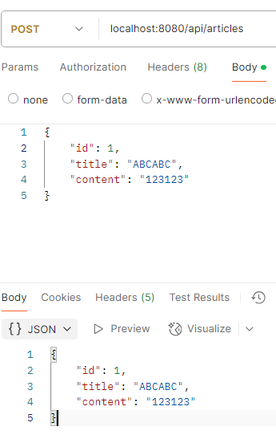

한 프로젝트에 실습코드와 연습문제를 한번에 넣는 구조로 구성함

이점 : 동일한 환경을 공유할 수 있음


3장

뷰 이름을 반환할 땐 '/'로 시작하면 안된다 
ex)
GetMapping("/signup")
public String newMemberForm(){
return "signup";
}

     @GetMapping("/sign-up")
    public String newMemberForm(){
        return "sign-up"; //이 부분이다.
    }

    @PostMapping("/sign-up")
    public String saveMember(MemberForm form){

이런식으로 사용하면 된다.

또한 resources/templates 에 해당 머스타츠 파일이 있어야 웹 페이지에 접속할 수 있다.


세미나_0213
프론트서버, 백엔드서버, DB 이 세가지가 주어졌을 때
각각 서버의 문제를 200번대, 400번대, 500번대로 오류 메세지를 클라이언트 측에 넘겨서 문제를 찾을 수 있다.
이때 각 오류 번호들은 프론트와 백엔드 등 여러 팀간의 약속으로 정할 수 있다.

2만개의 get 요청을 보낼 필요 없이, 각 페이지가 10개의 게시글을 나타낸다고 하면
10개의 get요청을 보내면 된다. 이때 get요청은 각 게시글의 고유ID를 의미할 수 있다.

무결성이 검증되지 않은 데이터를 사용하면 SQLInjection이 가능하다. 
그래서 서버와 백엔드 간에 프로토콜을 파악하기 어렵게 만들어야 한다.


<hr>
4장

Slf4j : Simple Logging Facase for Java (로깅기능)

<hr>
5장

No default constructor for entity -> 해당 엔티티에 기본 생성자가 없어서 에러가 났음
<hr>
7장

뷰 페이지에서 변수를 사용할 떄는 중괄호를 두 개({{}})를 쓰지만 컨트롤러에서 URL변수를 사용할 때는 하나({})만 쓴다.
<hr>
<h2>8장 <데이터 삭제하기></h2>

@GetMapping("/articles/{id}/delete")<br>
public String delete(){<br>
log.info("삭제 요청이 들어왔습니다!");<br>
//1. 삭제할 대상 가져오기<br>
//2. 대상 엔티티 삭제하기<br>
//3. 결과 페이지로 리다이렉트하기<br>
return null;<br>
}<br>

위 순서대로 한다.
<hr>

**한 번 쓰고 사라지는 휘발성 데이터를 등록하는 법**<br>
형식 : 객체명.addFlashAttribute(넘겨_주려는_키_문자열, 넘겨_주려는_값_객체);<br><br>
<hr>

**데이터를 삭제할 때 사용하는 SQL문**<br>
형식 : DELETE [FROM] 테이블명 WHERE 조건; []:생략 가능<br><br>
<hr>

**삭제 순서 정리**<br>
1. 클라이언트가 삭제 요청을 함
2. 컨트롤러에서 @GetMapping으로 article/{id}/delete를 받음
3. 이때 id는 @PathVariable을 사용하여 외부 매개변수 사용을 가능케 함
4. 리파지터리에서 해당 id로("findById(id)"이용) DB에 있는 삭제 대상인 값을 찾음 //이때 findById()메서드는 Spring Data JPA의 JpaRepository 인터페이스에서 제공되는 메서드임
5. 리파지터리에 있는 delete() 메서드로 데이터를 삭제함(이때 자동으로 SQL문이 실행됨)
6. 삭제 작업이 끝나면 "/articles"로 리다이렉트함
7. "heder.mustache"에 있는 msg창을 띄움
8. 이때 리다이렉트되는 시점에 휘발성 데이터를 등록하기 위해 RedirectAttribytes 객체의 addFlashAttribute() 메서드를 이용함.
<br><br>
<hr>

**연습문제를 풀때 DB에 초기값을 넣기 위해선 data.sql에 SQL문을 넣어야함**
스프링 부트는 data.sql파일만 자동으로 인식함
<hr>

**쿼리(query)란**<br>
DB에 정보를 요청하는 구문
<br>
<hr>
<h3>9장 <CRUD와 SQL쿼리 종합></h3>

**JDBC URL 고정하기**<br>
#DB URL 설정<br>
#유니크 URL 생성하지 않기<br>
spring.datasource.generate-unique-name=false<br>
#고정 URL 설정하기<br>
spring.datasource.url=jdbc:h2:mem:testdb<br>
<hr>

**생성 테이블 명 설정하기**<br>
엔티티 클래스에 @Table어노테이션을 사용하여 @Table(name = "ORDERS")를 선언하면 클래스 명과 상관없이 이름이 설정된다<br>
<br>
<hr>
<h3>10장 </h3><br>

**PUT**:기존 데이터를 전부 새 내용으로 변경. 만약 기존데이터가 없으면 새로 생성<br>
**PATCH**:기존 데이터 중에서 일부만 새 내용으로 변경<br>

**HTTP 상태 코드**<br>
1xx(정보) : 요청이 수신돼 처리중<br>
2xx(성공) : 요청이 정삭정으로 처리됨<br>
3xx(리다이렉션 메시지) : 요청을 완료하려면 추가 행동 필요<br>
4xx(클라이언트 요청 오류) : 클라이언트의 요청이 잘못돼 서버가 요청을 수행할 수 없음<br>
5xx(서버 응답 오류) : 서버 내부에 에러가 발생해 클라이언트 요청에 대해 적절히 수행하지 못했음<br>
<hr>

**포스트맨에서 PATCH로 데이터 수정하기**<br>
https://jsonplaceholder.typicode.com/posts/1 처럼 1번 게시물을 URL로 설정한 뒤<br>
```json
{
    "title": "abcdf",
    "body" : "123456"
}
```
전송 방식을 PATCH로 변경하고 SEND를 누르면<br>
```json
{
    "userId": 1,
    "id": 1,
    "title": "abcdf",
    "body": "123456"
}
```
응답이 200으로 뜨고 1번 게시물의 데이터가 변경된다<br>
<hr>

**포스트맨에서 DELETE로 데이터 삭제하기**<br>
https://jsonplaceholder.typicode.com/posts/1 처럼 1번 게시물을 URL로 설정한 뒤<br>
전송 방식을 DELETE로 변경하고 SEND를 누르면<br>
응답이 200으로 뜨고 1번 게시물이 삭제된다<br>
<hr>

**연습문제**
**1. 오늘 할 일 생성**<br>
<br>

**2. 오늘 할 일 조회**<br>
<br>

**3. 오늘 할 일 수정**<br>
<br>

**4. 오늘 할 일 삭제**<br>
<br>
어차피 id는 고유하므로 users/10 지정 필요없이 todos/200으로 삭제 가능하다<br>

<hr>

<h3>11장</h3><br>
**응답으로 오는 상태 코드**<br>
200 : 요청 성공<br>
201 : 데이터 생성을 완료함<br>
404 : 요청한 정보를 찾을 수 없음<br>
500 : 서버에 오류 발생<br>

<br>

**REST 컨트롤러와 일반 컨트롤러의 차이점**<br>
REST 컨트롤러 : JSON이나 텍스트 같은 데이터를 반환<br>
일반 컨트롤러 : 뷰 페이지를 반환<br><br>
<hr>

**전체 게시글 조회하기**<br>

1. 클래스 내부에 articleRepository를 선언, 스프링 부트가 제공하므로 @Autowired 어노테이션을 붙여 의존성 주입<br>
```java
@Autowired
    private ArticleRepository articleRepository;
```

2. @GetMapping으로 "api/articles" 주소로 오는 URL 요청을 받음. 메서드 수행 결과로 Article 묶음을 반환하므로 반환형이 List<Article>인 index()라는 메서드를 정의.
```java
// GET
    @GetMapping("/api/articles")
    public List<Article> index(){
        return articleRepository.findAll();
    }
```
<hr>

**단일 게시글 조회하기**<br>

1. 조회하려는 게시글의 id에 따라 URL 요청이 바뀌어야 하므로 @GetMapping의 URL을 "/api/articles/{id}"로 수정
2. 메서드 수행 결과로 단일 Article을 반환함. 메서드 이름 구분을 위해 show()로 수정. return문은 DB에서 id로 검색해 얻은 엔티티를 가져오도록 수정하고, 만약 해당 엔티티가 없으면 null을 반환하도록 함.
3. DB에서 id로 검색하기 위해 show()메서드의 매개변수로 id를 가져와야 함. 이때 id를 요청 URL에서 가져오기 때문에 @PathVarialble을 붙임

```java
// POST
    @GetMapping("/api/articles/{id}")
    public Article show(@PathVariable Long id){
        return articleRepository.findById(id).orElse(null);
    }
```
<hr>

**POST 구현하기 (데이터 생성요청 보내기)**<br>

1. @PostMapping 으로 "/api/articles" 주소로 오는 URL 요청을 받는다
2. 반환형이 Article 인 create()라는 메서드를 정의하고 수정할 데이터를 dto 매개변수로 받아옴. 받아 온 dto를 DB에서 활용할 수 있도록 엔티티로 변환해 article변수에 넣고, articleRepository를 통해 DB에 저장 후 반환한다.
```java
// POST
@PostMapping("/api/articles")
public Article create(@RequestBody ArticleForm dto) {
    Article article = dto.toEntity();
    return articleRepository.save(article);
}
```
@RequestBody 를 써야 JSON의 BODY에 실어 보내는 데이터를 create() 메서드의 매개변수로 받아올 수 있다.<br>
<hr>

**PATCH 구현하기 (데이터 수정하기)**<br>
1. @PatchMapping 으로 "/api/articles/{id}" 주소로 오는 URL 요청을 받음.
2. 반환형이 Article인 update()라는 메서드를 정의하고 매개변수로 요청 URL의 id와 요청 메시지의 본문 데이터를 받아옴.

메서드의 본문은 다음 네 부분으로 나누어 작성
1. DTO -> 엔티티 변환
2. 타깃 조회
3. 잘못된 요청 처리
4. 업데이트 및 정상 응답(200)

* ResponseEntity는 REST 컨트롤러의 반환형, 즉 REST API의 응답을 위해 사용하는 클래스
* REST API 요청응ㄹ 받아 응답할 때 이 클래스에 HTTP 상태 코드, 헤더, 본문을 실어 보낼 수 있음
* HttpsStatus는 HTTP 상태 코드를 관리하는 클래스로, 다양한 Enum 타입과 관련한 메서드를 가짐 (형식 : 열거형이름.상수)

**전체 코드**
```java
// PATCH
    @PatchMapping("/api/articles/{id}")
    public ResponseEntity<Article> update(@PathVariable Long id, @RequestBody ArticleForm dto){
        //1. DTO -> 엔티티 변환
        Article article = dto.toEntity();
        log.info("id: {}, article: {}", id, article.toString()); //로그 찍기
        //2. 타깃 조회
        Article target = articleRepository.findById(id).orElse(null);
        //3. 잘못된 요청 처리하기
        if(target == null || id != article.getId()){
            // 400, 잘목된 요청 응답!
            log.info("잘못된 요청! id: {}, article: {}", id, article.toString());
            return ResponseEntity.status(HttpStatus.BAD_REQUEST).body(null);
        }
        //4. 업데이트 및 정상 응답(200)
        target.patch(article); // 기존 데이터에 새 데이터 붙이기
        Article updated = articleRepository.save(target); // 수정 내용 DB에 최종 저장
        return ResponseEntity.status(HttpStatus.OK).body(updated);
    }
```

* URL의 번호와 JSON의 id 번호가 일치하면 수정 성공


**DELETE 구현하기**<br>
1. @DeleteMapping으로 URL 요청을 받는다
2. delete() 메서드를 정의하고 URL의 id를 매개변수로 받아 온다
3. DB에서 대상 엔티티를 조회한다
4. 대상 엔티티가 없을시 생기는 잘못된 요청을 처리한다
5. 대상 엔티티가 있으면 삭제하고 정상 응답(200)을 반환한다

* return문에 body(null) 대신 build()를 작성해도 되는 이유<br>
: build 메서드는 HTTP 응답의 body가 없는 ResponseEntity객체를 생성하기 때문이다<br>

<h3>연습문제</h3><br>
1. 전체 데이터 조회

2. 특정 데이터 조회

3. POST 구현 (데이터 생성 요청)

4. PATCH 구현 (데이터 수정) +) 기존 데이터에 붙임

5. DELETE 구현


# 12장 <서비스 계츨과 트랜잭션>

* 서비스란?
: 컨트롤러와 리파지터리 사이에 위치하는 계층으로, 서버의 핵심 기능(비즈니스 로직)을 처리하는 순서를 총괄한다

* 트렌잭션이란?
: 모두 성공해야 하는 일련의 과정. 쪼갤 수 없는 업무 처리의 최소 단위

* 롤백이란?
: 트랜잭션이 실패로 돌아갈 경우 진행 초기 단계로 돌리는 것

* 기존 컨트롤러는 컨트롤러 + 서비스 구조였음, 12장에서는 이를 분할 함


* 컨트롤러의 역할 : 클라이언트 요청받기, 응답하기
* 서비스의 역할 : 리파지터리에 데이터 가져오도록 명령하기

## 12.2 서비스 계층 만들기

### 12.2.1 게시글 조회 요청 개선하기
* 개선을 하기 위해서는 더 이상 리파지터리와 컨트롤러가 만날 일 없이 서비스가 해당 요청을 처리하도록 수정해야한다.
* 개선 후 형태
```java
@GetMapping("/api/articles/{id}") 
    public Article show(@PathVariable Long id){
        // 바로 return을 하여 코드를 간소화 한다. 이때 service에 함수와 매개변수를 정의해준다.
        return articleService.show(id);
    }
```
* dto   
-> POST와 같은 요청 메시지에 담긴 데이터를 전달해야 할때 사용   

* 성공, 실패 응답하기
```java
return (created != null) ? // 생성을 성공하면 정상, 실패하면 오류 응답 (삼항 연산자)
                ResponseEntity.status(HttpStatus.OK).body(created) : // 생성을 성공했을 때 OK 반환
                ResponseEntity.status(HttpStatus.BAD_REQUEST).build(); // 생성을 실패할 때 BAD_REQUEST 반환
```
위에서 응답하는 형식처험 조건에 따라 good 또는 bad를 실행할 때는 삼항 연산자를 사용

```java
ResponseEntity.status(상태코드).응답엔티티; // 이렇게 응답하면 된다
```

* controller에서 호출한 service 예시
```java
public Article create(ArticleForm dto) {
        Article article = dto.toEntity(); // controller에서 요청한 dto를 entity형태로 변환
        return articleRepository.save(article); // 변환된 entity를 DB에 저장
    }
```
* 글 생성 postman 화면


* **post요청이지만 id를 1로 설정하면 글이 수정되어버리는 오류 발생**


* 글에 Id가 포함되어 있으면 -> null 반환
```java
public Article create(ArticleForm dto) {
        Article article = dto.toEntity(); // controller에서 요청한 dto를 entity형태로 변환
        if(article.getId() != null){ // article, 즉 entity에 id가 있으면 getId()메소드가 작동하므로 
            return null; // null을 반환한다
        }
        return articleRepository.save(article); // 변환된 entity를 DB에 저장
    }
```
글을 수정하려고 하면 400 오류코드가 뜸


### 12.2.3 게시글 수정 요청 개선하기
* ArticleApiController.java 
간결하게 바뀌었다.
```java
// PATCH
    @PatchMapping("/api/articles/{id}")
    public ResponseEntity<Article> update(@PathVariable Long id, @RequestBody ArticleForm dto){
        Article updated = articleService.update(id, dto);
        return (updated != null) ?
                ResponseEntity.status(HttpStatus.OK).body(updated):
                ResponseEntity.status(HttpStatus.BAD_REQUEST).build();
    }
```

* 기존 Controller의 로직을 ArticleService.java에 이동
```java
public Article update(Long id, ArticleForm dto) {
        //1. DTO -> 엔티티 변환
        Article article = dto.toEntity();
        log.info("id: {}, article: {}", id, article.toString()); //로그 찍기
        //2. 타깃 조회
        Article target = articleRepository.findById(id).orElse(null);
        //3. 잘못된 요청 처리하기
        if(target == null || id != article.getId()){
            // 400, 잘목된 요청 응답!
            log.info("잘못된 요청! id: {}, article: {}", id, article.toString());
            return null;
        }
        //4. 업데이트 및 정상 응답(200)
        target.patch(article); // 기존 데이터에 새 데이터 붙이기
        Article updated = articleRepository.save(target); // 수정 내용 DB에 최종 저장
        return updated; // 수정 데이터를 반환
    }
```

### 12.2.4 게시글 삭제 요청 개선하기

* 간결하게 바뀐 ArticleApiController.java 
```java
// DELETE
    @DeleteMapping("/api/articles/{id}")
    public ResponseEntity<Article> delete(@PathVariable Long id){
        Article deleted = articleService.delete(id);
        return (deleted != null) ?
                ResponseEntity.status(HttpStatus.NO_CONTENT).build(): // deleted에 내용이 있다면 -> 정상적으로 삭제, NO_CONTENT 상태로 빌드만 해서 보냄
                ResponseEntity.status(HttpStatus.BAD_REQUEST).build(); // deleted에 내용이 없다면 -> 삭제 안됨, BAD_REQUEST 상태로 빌드만 해서 보
    }
```

* 마찬가지로 기존 Controller의 로직을 ArticleService.java에 이동
```java
public Article delete(Long id) {
        //1. 대상 찾기
        Article target = articleRepository.findById(id).orElse(null);
        //2. 잘못된 요청 처리하기
        if(target == null){
            return null;
        }
        //3. 대상 삭제하기
        articleRepository.delete(target);
        return target; // 삭제한 대상을 컨트롤러에 반환
    }
```

* 삭제 확인


* 1분 퀴즈   
-> 2번

## 12.3 트랜잭션 맛보기

* 트랜잭션   
: 반드시 성공해야만 하는 일련의 과정, 만약 성공하지 못하면 rollback됨

* 시나리오
1. 게시판에 데이터 3개를 한꺼번에 생성 요청하기
2. 데이터를 DB에 저장하는 과정에서 의도적으로 오류 발생시키기
3. 어떻게 롤백되는지 확인하기

* 스트림 문법   
: 리스트와 같은 자료구조에 저장된 요소를 하나씩 순회하면서 처리하는 코드 패턴

```java
// 1. dto 묶음(리스트)을 엔티티 묶음(리스트)으로 변환하기
        List<Article> articleList = dtos.stream()
                .map(dto -> dto.toEntity())
                .collect(Colletors.toList());
```

* 강제로 예외 상황을 발생시켰기 때문에 상태코드 500으로 응답


* 데이터 생성 실패 이전 상황으로 되돌리듯이 트랜젝션을 사용하고 싶다 -> 트랜젝션 선언 (@Transactionl)
```java
   @Transactional
    public List<Article> createArticles(List<ArticleForm> dtos) {
        // 1. dto 묶음(리스트)을 엔티티 묶음(리스트)으로 변환하기
        List<Article> articleList = dtos.stream()
                .map(dto -> dto.toEntity())
                .collect(Collectors.toList());
        // 2. 엔티티 묶음(리스트)을 DB에 저장하기
        articleList.stream() // articleList를 스트림화
                .forEach(article -> articleRepository.save(article)); // article이 하나씩 올 때마다 articleRepository를 통해 DB를 저장
        // 3. 강제로 에러를 발생시키기
        articleRepository.findById(-1L) // -1 인 Id는 없음, 일부러 에러를 발생시키는 것임
                .orElseThrow(() -> new IllegalArgumentException("결제 실패!")); // 찾는 데이터가 없으면 예외 발생
        // 4. 결과 값 반환하기
        return articleList; // 형식상 반환
    }
}
```
위 코드에서는 강제로 오류를 발생시켜 데이터 생성을 롤백 시킴   

* 1분 퀴즈   
-> ㄱ: 트랜젝션, ㄴ: 롤백   

## 셀프체크
* service파일을 만들었는데 controller에서 인식이 안된다   
-> service 파일 첫 번째 줄에 package com.example.firstproject.service; 를 붙여보자   

* error: incompatible types: Coffee cannot be converted to ResponseEntity<Coffee>
  return target;   
```java
@PostMapping("/api/coffees")
    public Coffee create(@RequestBody CoffeeDto dto) {
        Coffee created =  coffeeService.create(dto);
        return (created != null) ?
                ResponseEntity.status(HttpStatus.OK).body(created):
                ResponseEntity.status(HttpStatus.BAD_REQUEST).build();
    }
```
-> 메서드 선언부에는 Coffee 타입을 반환한다고 되어있음, 하지만 return 에서는 ResponseEntity를 반환함.
**해결법**   
-> 메서드 선언부의 Coffee -> ResponseEntity<Coffee> 형으로 수정

* update 메서드가 제대로 동작하지 않음


* create 서비스에서의 예외처리   
-> coffee 가 신규로 작성되었다면 body에 id가 있을 필요가 없기 때문에 getId()메서드로 예외처리
```java
public Coffee create(CoffeeDto coffeeDto) {
        Coffee coffee = coffeeDto.toEntity();
        // coffee 가 신규로 작성되었다면 body에 id가 있을 필요가 없기 때문에 getId()메서드로 예외처리
        if(coffee.getId() != null){
            return null;
        }
        return coffeeRepository.save(coffee);
    }
```

* 간결하게 코드 구성하기   
-> 서비스의 update 메서드에서 updated는 불필요하기 때문에 축약
```java
//target.patch(coffee);
//        Coffee updated = coffeeRepository.save(target);
//        return updated;
    //위 코드를 아래와 같이 축약할 수 있다
target.patch(coffee);
        return coffeeRepository.save(target);
```

# 13장 테스트 코드 작성하기
## 13.1 테스트란
* 테스트: 프로그램의 품질을 검증하는 것   

* 테스트 코드의 3단계
1. 예상 데이터 작성하기
2. 실제 데이터 획득하기
3. 예상 데이터와 실제 데이터 비교해 검증하기

* 디버깅: 테스트를 통과하지 못하면 잘못된 부분을 찾아 고치는 것(성공하면 -> 리팩터링)

* 테스트 케이스: 테스트 코드를 다양한 경우를 대비해 작성한 것   
-> 성공할 경우, 실패할 경우등 여러 다양한 상황을 예상해 세부적으로 작성

* 테스트 주도 개발(Test Driven Development): 테스트 코드를 만든 후 이를 통과하는 최소한의 코드부터 시작해 점진적으로 코드를 개선 및 확장해 나가는 개발 방식


## 13.2 테스트 코드 작성하기
### 13.2.1 테스트 코드 기본 틀 만들기
```java
package com.example.firstproject.service;

import org.junit.jupiter.api.Test; // Test 패키지 임포트
import org.springframework.beans.factory.annotation.Autowired;
import org.springframework.boot.test.context.SpringBootTest;

import static org.junit.jupiter.api.Assertions.*; // 앞으로 사용할 수 있는 패키지 임포트

@SpringBootTest // 해당 클래스를 스프링 부트와 연동해 통합 테스트를 수행하겠다고 선언 -> 테스트 코드에서 스프링 부트가 관리하는 다양한 객체를 주입받을 수 있음
class ArticleServiceTest {
    
    @Autowired
    ArticleService articleService; // articleService 객체 주입
    @Test // 해당 메서드가 테스트 코드임을 선언
    void index() {
    }
}
```

### 13.2.2 index()테스트 하기

* 테스트 하는 순서
1. 예상 데이터 작성하기
2. 실제 데이터 획득하기
3. 예상 데이터와 실제 데이터 비교해 검증하기

* Arrays.asList() 메서드   
: 입력된 배열 또는 2개 이상의 동일한 타입 데이터를 정적 리스트로 만들어 반환. 정적 리스트는 고정 크기 -> add(), remove() 사용 불가능   
정적 리스트에 add(), remove() 메서드를 사용하려면 -> 정적 리스트를 일반 리스트로 새로 만들어야 함   

**정적 리스트 -> 새 ArrayList로 만드는 예**

```java
List<String> list = new ArrayList<>(fixedSizeListA);
```

* 테스트 코드
```java
@SpringBootTest // 해당 클래스를 스프링 부트와 연동해 통합 테스트를 수행하겠다고 선언 -> 테스트 코드에서 스프링 부트가 관리하는 다양한 객체를 주입받을 수 있음
class ArticleServiceTest {

    @Autowired
    ArticleService articleService; // articleService 객체 주입
    @Test // 해당 메서드가 테스트 코드임을 선언
    void index() {
        // 1. 예상 데이터
        Article a = new Article(1L, "가가가가", "1111"); // 예상 데이터 객체로 저장
        Article b = new Article(2L, "나나나나", "2222");
        Article c = new Article(3L, "다다다다", "3333");
        List<Article> expected = new ArrayList<>(Arrays.asList(a, b, c)); // a, b, c 합치기
        // 2. 실제 데이터
        List<Article> articles = articleService.index(); // 모든 게시글을 조회 요청하고 그 결과로 반환되는 게시글의 묶음을 받아옴
        // 3. 비교 및 검증
        assertEquals(expected.toString(), articles.toString());
    }

    @Test
    void show_성공_존재하는_id_입력() {
        // 1. 예상 데이터
        Long id = 1L;
        Article expacted = new Article(id, "가가가가", "1111");
        // 2. 실제 데이터
        Article article = articleService.show(id); // 실제 데이터 저장
        // 3. 비교 및 검증
        assertEquals(expacted.toString(), article.toString()); // 비교
    }
    @Test
    void show_실패_존재하지_않는_id_입력() {
        // 1. 예상 데이터
        Long id = -1L;
        Article expacted = null;
        // 2. 실제 데이터
        Article article = articleService.show(id); // 실제 데이터 저장
        // 3. 비교 및 검증
        assertEquals(expacted, article); // 실제 데이터, 예상 데이터의 값 null은 toString() 메서드를 호출할 수 없음
    }
}
```

### 13.2.4 create() 테스트하기
```java
@Test
    void create_성공_title과_content만_있는_dto_입력() {
        // 1. 예상 데이터
        String title = "라라라라";
        String content = "4444";
        ArticleForm dto = new ArticleForm(null, title, content);
        Article expected = new Article(4L, title, content);
        // 2. 실제 데이터
        Article article = articleService.create(dto);
        // 3. 비교 및 검증
        assertEquals(expected.toString(), article.toString());
    }
    @Test
    void create_실패_id가_포함된_dto_입력() {
        // 1. 예상 데이터
        Long id = 4L;
        String title = "라라라라";
        String content = "4444";
        ArticleForm dto = new ArticleForm(id, title, content);
        Article expacted = null;
        // 2. 실제 데이터
        Article article = articleService.create(dto);
        // 3. 비교 및 검증
        assertEquals(expacted, article); // 어차피 null 이므로 .toString() 메서드는 사용하지 않는다
    }
```

### 13.2.5 여러 테스트 케이스 한 번에 실행하기
* 각 테스트 케이스별로는 잘 실행되었지만, 여러 테스트 케이스를 한번에 실행하니 실패할 때

-> 롤백을 하지 않았기 때문에 발생
-> 데이터 조회를 제외한 생성, 수정, 삭제하는 테스트를 할 때는 반드시 트랜젝션(@Transaction)으로 묶어 테스트가 종료되면 원래대로 돌아갈 수 있게 해줘야 함

* 1분 퀴즈   
ㄱ: (1)테스트 케이스   
ㄴ: (4)디버깅   
ㄷ: (5)리팩터링   
ㄹ: (2)@SpringBootTest   
ㅁ: (3)@Transactional   

### 셀프체크
* 비교를 할 때 .toString을 할것인지 Article자체로 비교할것인지 잘 선택해야하는 이유
```java
@Test
    @Transactional
    void delete_성공_존재하는_id_입력() {
        // 1. 예상 데이터
        Long id = 1L;
        Article expected = new Article(id, "가가가가", "1111");
        // 2. 실제 데이터
        Article article = articleService.delete(id);
        // 3. 비교 및 검증
        assertEquals(expected, article);
    }
```
위의 코드로 하면 

이런식으로 엔티티의 내용은 같지만 엔티티 객체가 다른 인스턴스이기 때문에 테스트가 성공하지 못한다.   
```java
        assertEquals(expected.toString(), article.toString());

```
.toString() 메소드를 사용하여 내용을 비교하면 테스트가 성공한다.   
-> 결론: **상황에 따라 알맞은 내용으로 비교 및 검증을 하자.**